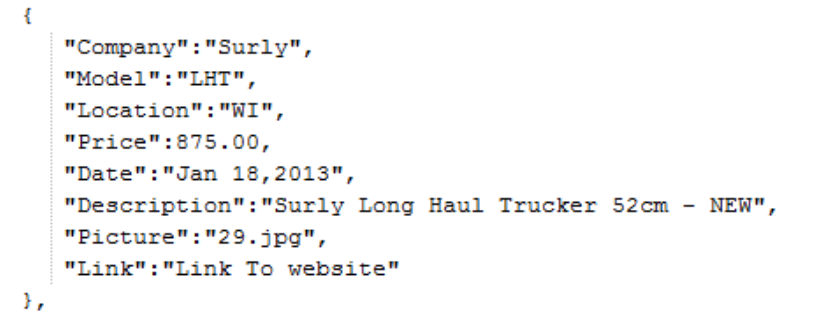
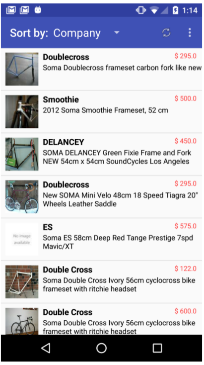
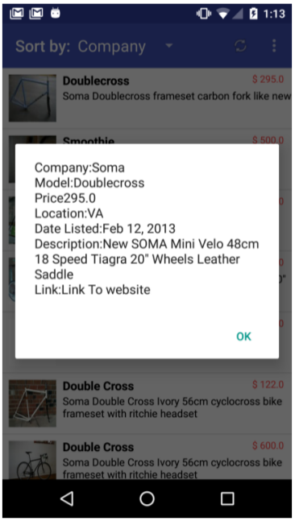

**CPEN 475**

**Project 4: Networked ListView with custom data adapter and display**

**Deliverables:** Complete Android Studio Project

**SampleProject:** p4_CraigsList_Sleleton.zip contains a sample project with *some* of the
content you need for this assignment. You may use this as the basis for
your project or you can develop a solution on your own. It’s your
choice.

**Overview:**

You are going to build an app that mimics craigslist. It will download a
static JSON string representing 30 or so bikes for sale. The string has
a good bit of data associated with each bike including a URL that points
to a thumbnail image of the bike. Please parse this data and display it
in a listview or listactivity. Please also provide a means of sorting
this list.

This app follows a common data presentation pattern;

1.  Present the user a sortable list with a little bit about every item.

2.  On item selection display a lot of information about that
    particular item.

You will use this technique a lot in industry.

**Grading:**

40% - Get parsed JSON in a list and display it in ListView

10% - Pref activity and Pref Listener to select download site

20% - Imageviews displayed properly and pegged to *proper* row of data

20% - Sorting done correctly

10% - Refresh button working correctly

**Essential Readings:**

1.  A fantastic how to of listview optimizations, includes viewholder
    and convertview patterns and downloading images asynchronously for
    each row in the listview;
    <http://lucasr.org/2012/04/05/performance-tips-for-androids-listview/>

2.  Making ListView Scrolling Smooth

[**http://developer.android.com/training/improving-layouts/smooth-scrolling.html**](http://developer.android.com/training/improving-layouts/smooth-scrolling.html)

**  
**

**Requirements:**

1.  On startup your app launches an async task which downloads either of
    the following files. This file contains all the data associated with
    each bike in JSON format

<http://www.tetonsoftware.com/bikes/>bikes.json

<http://www.pcs.cnu.edu/~kperkins/bikes/>bikes.json

bikes.json has a list of roughly 30 bikes. This is the data in the file
associated with ***one*** bike.

1.  Please develop a suitable object model to hold each bikes JSON data.
    For instance, a ***Bikedata*** object that holds Strings for
    Company, Model etc. ****Note that Price is not a string. You should
    also override the toString() method to return a suitably formatted
    string for displaying characteristics of a particular bike (see
    alert diagram in second figure below). These bike objects are
    complicated objects with several optional fields, therefore please
    use a builder to create them (see Builderpattern demo code)****

2.  Please choose a suitable Java collection to hold the list of
    ***Bikedata*** objects.

3.  Please develop suitable comparator classes for sorting your
    collection of ***Bikedata*** objects. If you are rusty on
    comparators and collection sorting here is a quick tutorial
    <http://www.vogella.com/blog/2009/08/04/collections-sort-java/> .
    Please be able to sort on the following fields.

    1.  Company

    2.  Location

    3.  Price

4.  The downloaded JSON data is in the form of a string. Parse this into
    objects and insert the objects into your chosen sortable collection.
    I’ve included a parser (JSONHelper) as part of the sample project.

5.  Please read Essential Readings 1 and 2 for help on implementing
    steps 7-9.

6.  Your Apps main UI consists of a Toolbar and a ListView that will
    look something like the following. Note the image and the custom
    view layouts for each row. (See lecture and sample code for listview
    with custom adapter).

1.  Please use a custom data adapter. It must implement both the
    convertview and the viewholder pattern.

2.  This adapter must have a custom rowlayout. Its purpose is to define
    how each row will look. I’ve included a functioning one as part of
    the sample project

3.  The ToolBar will have a spinner that allows you to select the sort
    order of the items in the list. I’ve included a bare bones spinner
    in the sample projects XML.

4.  The ToolBar must have a refresh icon, please find a suitable one and
    place it in the menu.xml. The handler for it should clear the list
    and then reload the JSON list of bikes and images. It should also
    reset the spinner to whatever the default search is.

5.  The app must have settings in the ToolBar overflow area. Please use
    it to pop up a preference activity that lets the user choose which
    site data is downloaded from (see step 1). **Use a listpreference
    for this! Do not make the user type in a website!**

6.  Once the user changes the sort order via the spinner, the list
    must resort. Here is how I sort the list in my ListViews
    dataadapter:

Collections.*sort*(data,**new** ComparatorModel());

ComparatorModel() is a separate class that sorts two Bikedata objects
based on the model: Here is its implementation

> class ComparatorModel implements Comparator&lt;BikeData&gt; {
>
> public int compare(BikeData myData1, BikeData myData2) {
>
> // if voth equal then 0
>
> return (myData1.Model.compareTo(myData2.Model));
>
> }
>
> }
>
> The sorting only resorts the collection, not the actual listview. Once
> you resort the data tell the listview to redraw itself by invoking the
> following command on the dataadapter;
>
> notifyDataSetChanged();

1.  If the user touches one of the items in the list, an onListItemClick
    listener will respond and pop up a Dialog which displays detailed
    information about which item is selected. (In a real app you would
    use fragments to display this information in a fashion appropriate
    to the screen size and orientation). See the following

**Displaying Images in the list**

Parsing the JSON into a list is easy. However note that all you get is a
URL for the picture and that’s what is stored in your list. Please
launch an async task to retrieve the image as the list is populated. See
Essential Readings 1 for how to do this;

**Gotchas**

You probably need to set timeouts on your http connections, otherwise if
rapidly scrolling the list you may exceed the maximum number of async
tasks you are allowed to run.

Some versions of android limit your app to 128 separate tasks, you go
over that you get a rejectedexecutionexception failure. You don’t catch
it your app crashes. **The executor service is a perfect solution for
this type of situation since you can create a threadpool and limit the
number of active threads.**

**Locking Orientation**

In this app you will be launching a bunch of threads to retrieve a lot
of images asynchronously? What do you do if the user rotates the phone
while these tasks are running? In a real app you would probably maintain
a list of threads, when the phone rotates, detach each and every thread
from its parent activity and then reattach when the activity is
recreated. That’s a lot of work for this app so use the following code
in your manifest to lock your **activity** in portrait mode.

android:screenOrientation="portrait"
